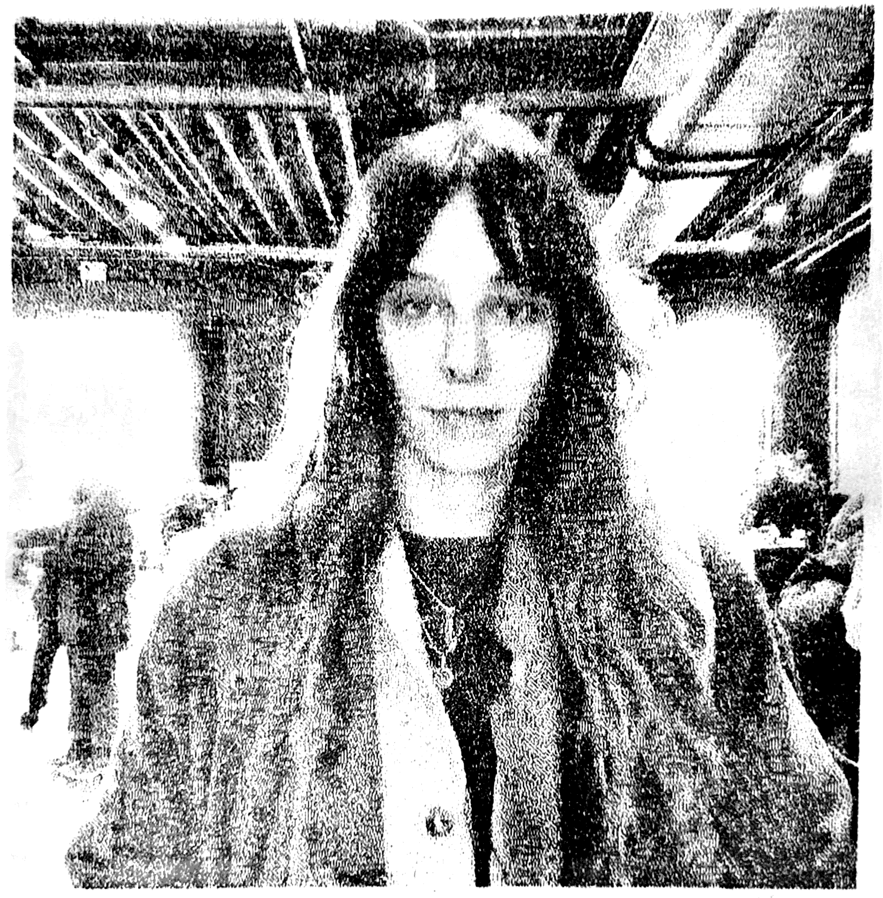

Lynn Avery is a musician, improviser, composer, and artist based in Brooklyn, NY. Her work moves through songcraft, dissonance, and texture, tracing the porous edges between form and space. She draws from traditions of field/bedroom recording, electro/acoustic experimentalism, maximalist/minimalist composition—treating sound as both artifact and inquiry.
Her projects include Iceblink and Pink Must, along with her ongoing collaborations with Cole Pulice.
She has collaborated with artists such as More Eaze, Wendy Eisenberg, Ryan Sawyer, Nadine, and Lia Kohl. 

She has performed at Pioneer Works, Knockdown Center, Public Records, Cedar Cultural Center, Mayhem (DK), OCCII(NL), and The Lab. Her music has been featured in Pitchfork, Bandcamp Daily, The Quietus, The Current, Raven Sings the Blues, and Aquarium Drunkard. She has composed music for film, and her work has been licensed for use in many forms of media.

Currently:
[ Lot Radio - long in the arms, with Pink Must - every 2nd Sunday @ 1pm et ](https://www.thelotradio.com/shows/long-in-the-arms-with-pink-must)
2/24/26 — Pink Must w/ e.r visit, Purgatory, Brooklyn NY  

[(more events...)](performances.html)