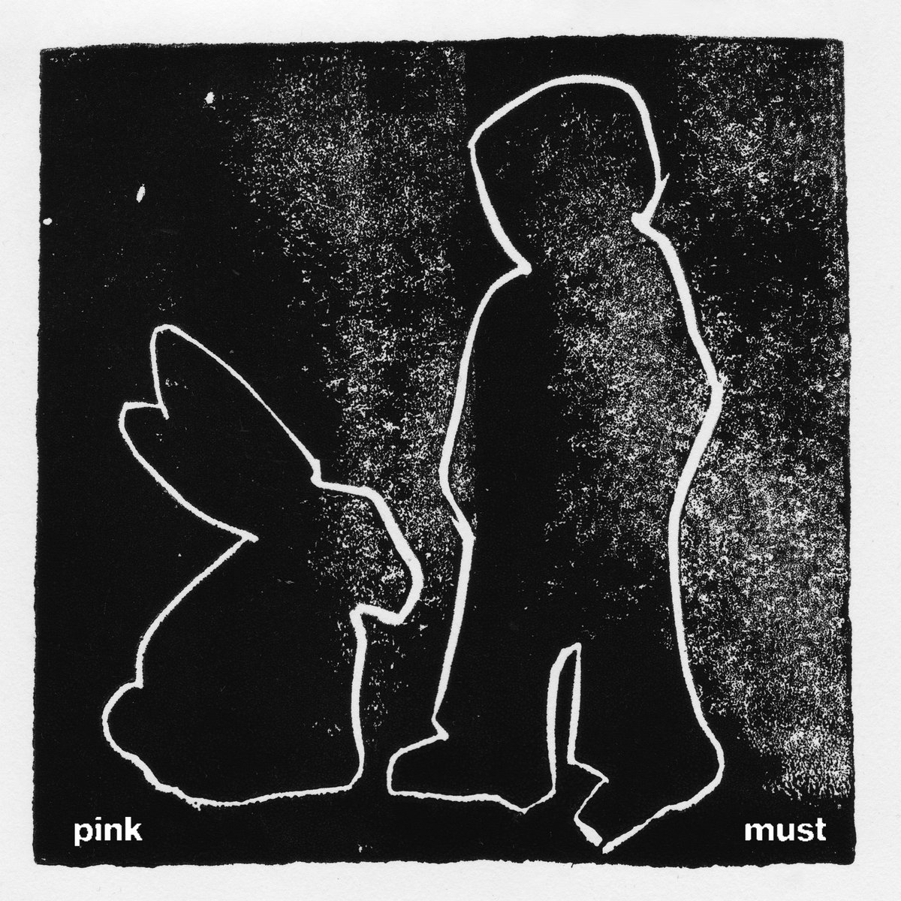
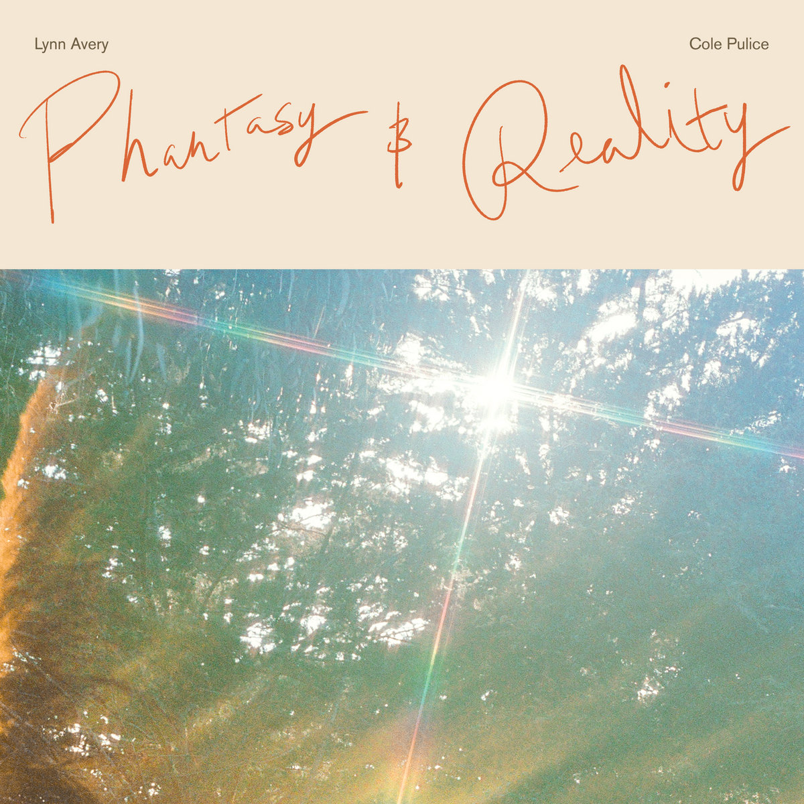
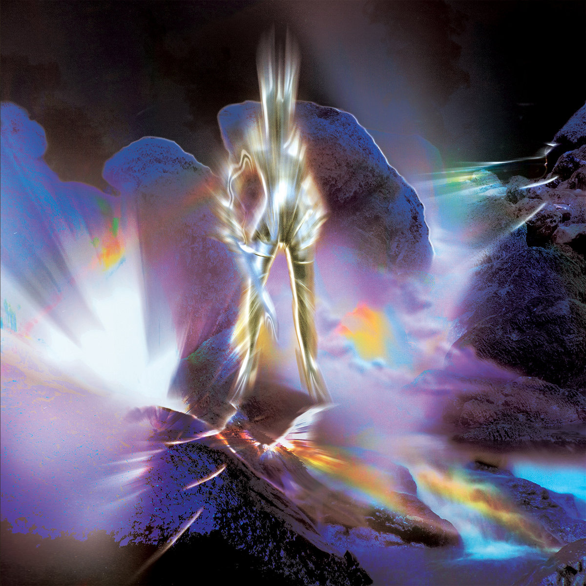
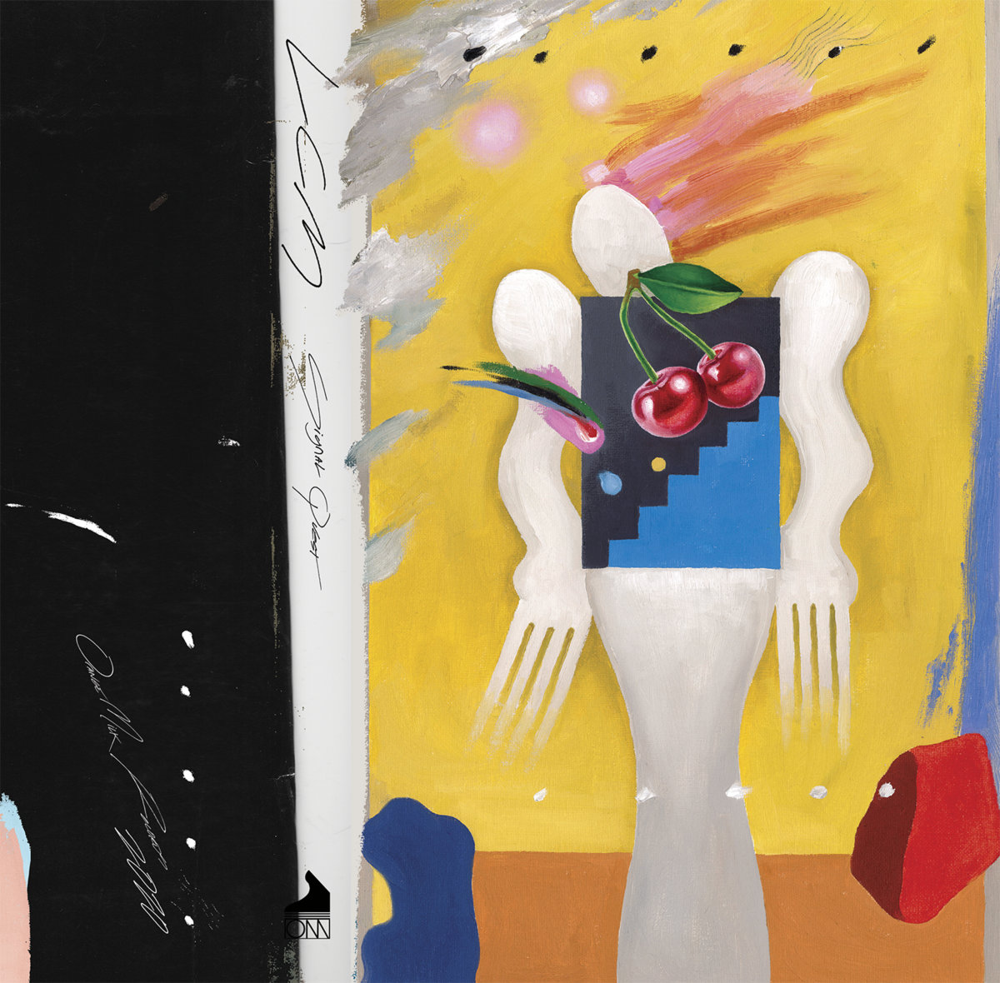

Lynn Avery is a musician, improvisor, composer, and artist who lives in Brooklyn, NY. She is known for Iceblink, Pink Must, and her collaborations with Cole Pulice. She has collaborated with artists such as More Eaze, Wendy Eisenberg, Ryan Sawyer, Nadine, and Lia Kohl. She has performed at venues such as Pioneer Works, Knockdown Center, Cedar Cultural Center, and The Lab. Her work has been featured in Pitchfork, the Current, Bandcamp Daily, The Quietus, Raven Sings the Blues, and Aquarium Drunkard. She has shared the stage with a wide range of artists from Laraaji and Daniel Lanois, to Machine Girl and Still House Plants.

## Works

[[expandable]]
| LP 2025 | Pink Must - *Pink Must* | 15 Love Records |
[Bandcamp](https://pinkmust.bandcamp.com) ✤ [Boomkat](https://boomkat.com/products/morphe-sun)

Press: [Pitchfork](https://pitchfork.com)
[[/expandable]]

[[expandable]]
| LP 2024 | Lynn Avery & Cole Pulice - *Phantasy & Reality* | Moon Glyph Records |
[Bandcamp](https://moonglyph.bandcamp.com/album/phantasy-reality)

Press: [Pitchfork](https://pitchfork.com/reviews/albums/lynn-avery-cole-pulice-phantasy-and-reality/), [Raven Sings the Blues](https://www.ravensingstheblues.com/lynn-avery-cole-pulice-2/)
[[/expandable]]

[[expandable]]
| LP 2023 | Signal Quest - *Hypermyth* | Orange Milk Records |
[Bandcamp](https://orangemilkrecords.bandcamp.com/album/hypermyth)

Press:
[[/expandable]]

[[expandable]]
| LP 2021 | Signal Quest (née LCM) - *Signal Quest* | Orange Milk Records |
[Bandcamp](https://orangemilkrecords.bandcamp.com/album/signal-quest). 

Press: 
[[/expandable]]

[[expandable]]
| LP 2021 | Lynn Avery & Cole Pulice - *To Live in Space & Time* | Moon Glyph Records |
[Bandcamp](https://moonglyph.bandcamp.com/album/to-live-die-in-space-time)

Press: [Pitchfork](https://pitchfork.com/reviews/albums/lynn-avery-cole-pulice-to-live-and-die-in-space-and-time/), [Quietus](https://thequietus.com/quietus-reviews/cassettes/constellation-tatsu-goatface-review/), [A Closer Listen](https://acloserlisten.com/2022/02/27/lynn-avery-cole-pulice-to-live-die-in-space-time/), [Complex Distractions](https://complexdistractions.blog/2022/06/08/lynn-avery-cole-pulice-to-live-die-in-space-time/)
[[/expandable]]

[[expandable]]
| LP 2020 | Iceblink - *Carpet Cocoon* | Moon Glyph Records |
[Bandcamp](https://iceblink.bandcamp.com)

Press: [Pitchfork](https://pitchfork.com/reviews/albums/inkblot-carpet-cocoon/), [Complex Distractions](https://complexdistractions.blog/2020/01/24/iceblink-carpet-cocoon/), [Hump Day News](https://www.humpday.news/music/iceblink-carpet-cocoon), [Reviler](https://www.reviler.org/2020/01/16/iceblink-carpet-cocoon-new-album-this-month/)
[[/expandable]]

 

[[expandable]]
Other Releases and Appearances:  
- Iceblink - Pews, ["Slipping Comp" 2025 Slipping]  
- Grumpy, Pink Must, Claire Rousay - Harmony [Single 2025 Bayonet Records]  
- Lynn Avery & Cole Pulice, Fleet Foxes - P.M. [TRANSA 2024 Red Hot]  
- More Eaze & Kaho Matsui ft. Lynn Avery - Get There [Computer and recording works for girls 2024 Full Spectrum Records]  
- More Eaze & Lynn Avery -  
- Dasychira - "Spindle (Lynn Avery Remix)" [2018 Blueberry Records]  
[[/expandable]]

## Performances

Upcoming Events:

| | | |
| :------- | :------: |  ---: |
| 10/6/25 | Lynn Avery | [TRANSA at Powerhouse, Brooklyn NY](https://festival.powerhousearts.org/festival-performances/transa) | 
| 2/7/26 | Pink Must  | [OOAM Fest, Baden, CH](https://ooam.ch/programm/)  |
| TBA | Pink Must | Prague |

Past Events:
| | |  |
|:- | :- | :-- |
| 9/27/25 | Pink Must | Knockdown Center, Queens NY |
| 9/12/25 | Iceblink | The Owl, Brooklyn NY |

[[expandable]]
2024
Blah
[[/expandable]]

[[expandable]]
2023
Blah blah
[[/expandable]]
[[expandable]]
Earlier
[Iceblink - "Healer" (Live on Radio K)](https://www.youtube.com/watch?v=d-7E0r07JtI)
10/28/18 Iceblink, Cedar Cultural Center -
[[/expandable]]

## Press

Conversations/Interviews:  
[The Hobbyist, 4/3/2025](https://schubethehobbyist.substack.com/p/the-hobbyist-10-more-eaze-lynn-avery-pink-must?utm_campaign=post&utm_medium=web)  
[Marg.MP3, 05/10/2025](https://www.instagram.com/p/DJex-2ZJSLA/?hl=en)
[The Current, Minneosta Public Radio 2020](https://www.thecurrent.org/feature/2020/04/21/iceblinks-warm-eclectic-chamber-pop-just-might-be-the-sound-you-need-right-now)  

Praise for *Carpet Cocoon*:  

Praise for *Pink Must*:

Praise for *To Live and Die in Space and Time*:
Features:  

[Citypages, Minnesota October 2020 Cover - Best New Artist(Iceblink)](https://www.thecurrent.org/feature/2020/04/21/iceblinks-warm-eclectic-chamber-pop-just-might-be-the-sound-you-need-right-now)

Read reviews and features in [Pitchfork](https://pitchfork.com), [Bandcamp Daily](https://daily.bandcamp.com), and [The Quietus](https://thequietus.com).

## Contact

US booking: lynn@pleasecalltobook.com  
EU/ROW: spike@spikefern.com

[[expandable]]
For licensing requests
Iceblink and Lynn Avery/Cole Pulice works are represented by [your management company](mailto:management@example.com)
For all other works, or for free-to-festival use please contact [lynn](mailto:lynn@pleasecalltobook)

[[/expandable]]
