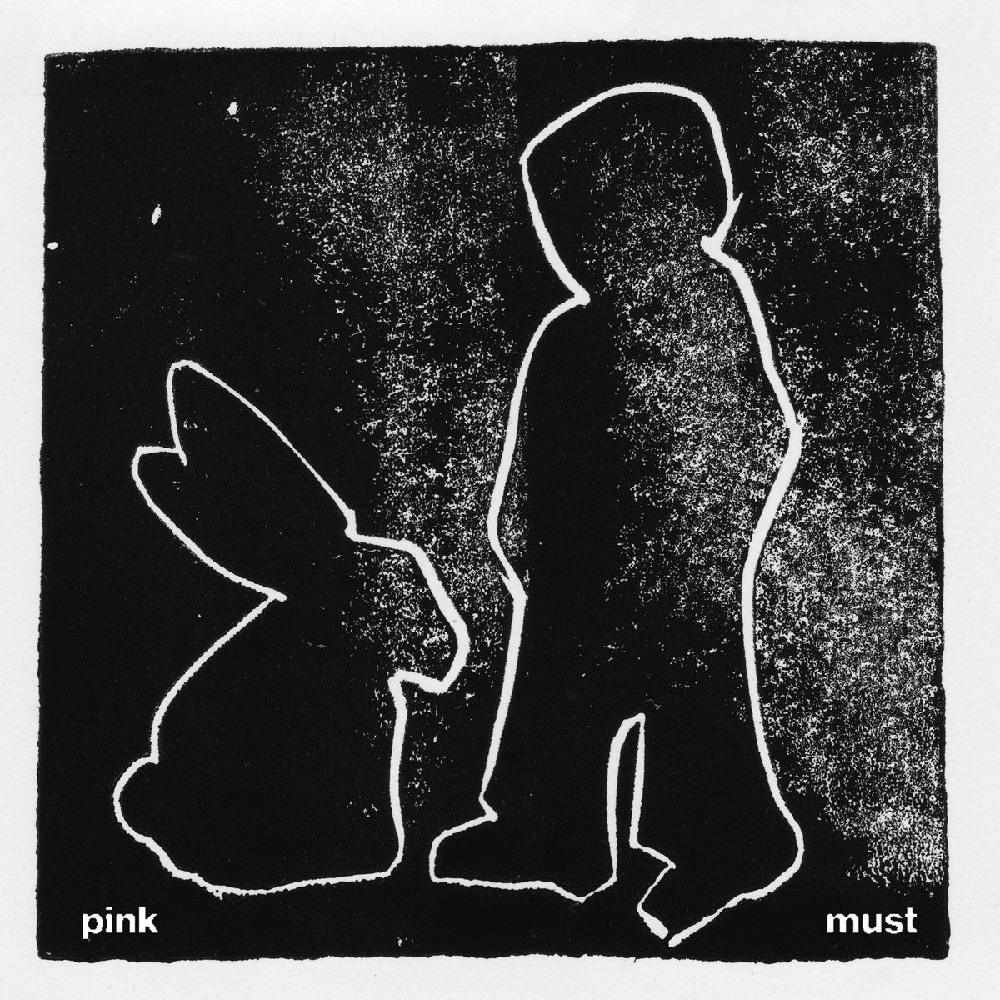
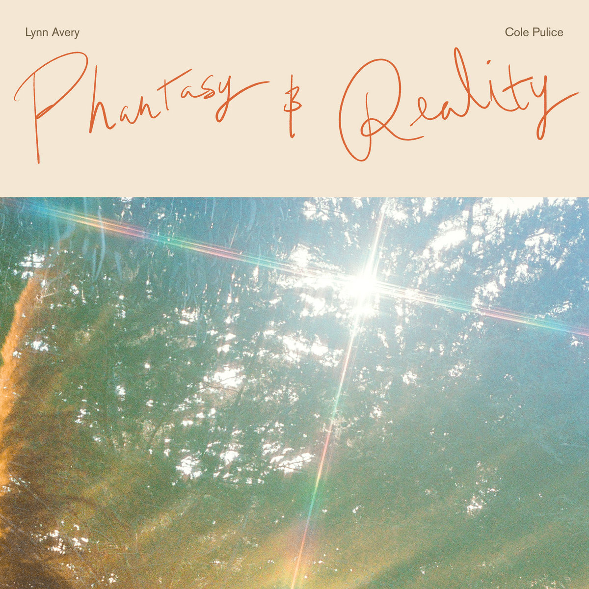
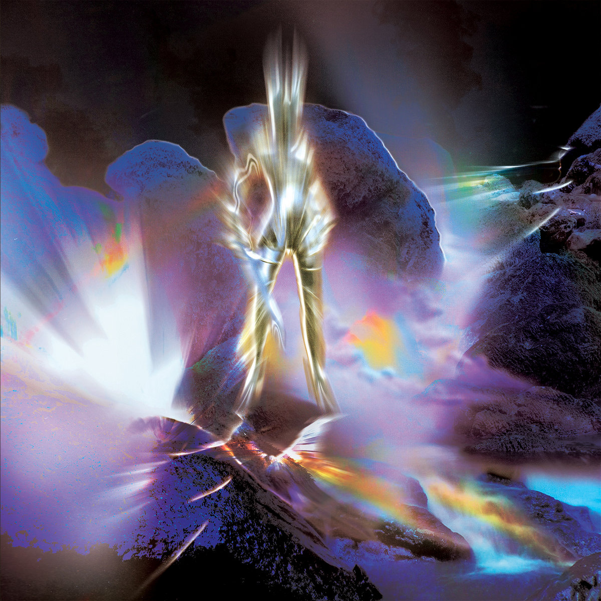
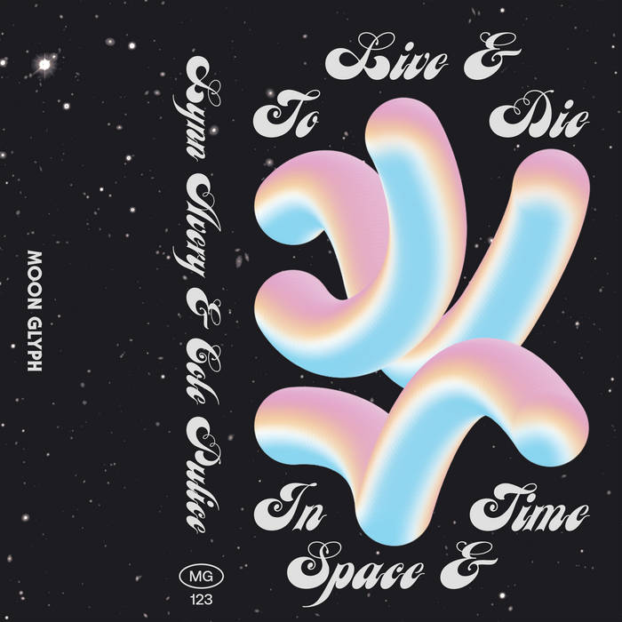
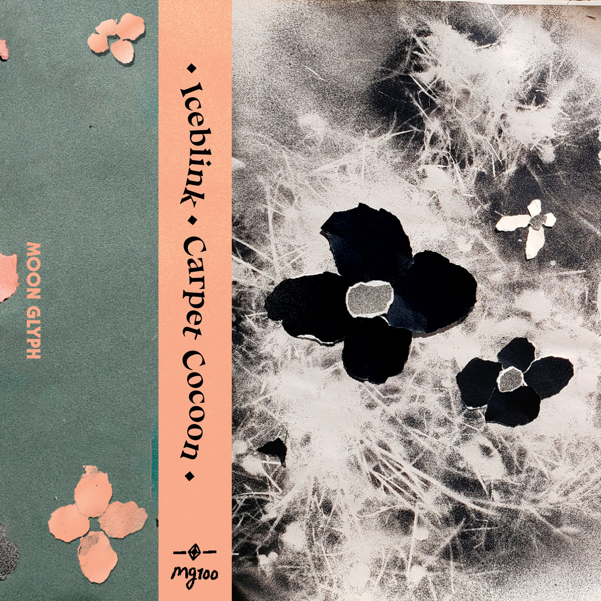

[[details]]
[[summary]]
|  2025 | Pink Must - *Pink Must* | 15 Love Records |
[[/summary]]
[Bandcamp](https://pinkmust.bandcamp.com) ✤ [Boomkat](https://boomkat.com/products/morphe-sun)

Press: [Pitchfork](https://pitchfork.com)
[[/details]]

[[details]]
[[summary]]
|  2024 | Lynn Avery & Cole Pulice - *Phantasy & Reality* | Moon Glyph Records |
[[/summary]]
[Bandcamp](https://moonglyph.bandcamp.com/album/phantasy-reality)

Press: [Pitchfork](https://pitchfork.com/reviews/albums/lynn-avery-cole-pulice-phantasy-and-reality/), [Raven Sings the Blues](https://www.ravensingstheblues.com/lynn-avery-cole-pulice-2/)
[[/details]]

[[details]]
[[summary]]
|  2023 | Signal Quest - *Hypermyth* | Orange Milk Records |
[[/summary]]
[Bandcamp](https://orangemilkrecords.bandcamp.com/album/hypermyth)

Press:
[[/details]]

[[details]]
[[summary]]
|  2022 | Lynn Avery & Cole Pulice - *To Live in Space & Time* | Moon Glyph Records |
[[/summary]]
[Bandcamp](https://moonglyph.bandcamp.com/album/to-live-die-in-space-time)

Press: [Pitchfork](https://pitchfork.com/reviews/albums/lynn-avery-cole-pulice-to-live-and-die-in-space-and-time/), [Quietus](https://thequietus.com/quietus-reviews/cassettes/constellation-tatsu-goatface-review/), [A Closer Listen](https://acloserlisten.com/2022/02/27/lynn-avery-cole-pulice-to-live-die-in-space-time/), [Complex Distractions](https://complexdistractions.blog/2022/06/08/lynn-avery-cole-pulice-to-live-die-in-space-time/)
[[/details]]

[[details]]
[[summary]]
|  2020 | Signal Quest (fka LCM) - *Signal Quest* | Orange Milk Records |
[[/summary]]
[Bandcamp](https://orangemilkrecords.bandcamp.com/album/signal-quest). 

Press: 
[[/details]]

[[details]]
[[summary]]
|  2020 | Iceblink - *Carpet Cocoon* | Moon Glyph Records |
[[/summary]]

Listen: [Bandcamp](https://iceblink.bandcamp.com)
"Sweetly melancholic, intimate, and highly textural music." - Bandcamp  
"In Lynn Avery's hands, the cosmos feels like it could fit in your pocket." - Pitchfork 

Press: [Pitchfork](https://pitchfork.com/reviews/albums/inkblot-carpet-cocoon/), [Complex Distractions](https://complexdistractions.blog/2020/01/24/iceblink-carpet-cocoon/), [Hump Day News](https://www.humpday.news/music/iceblink-carpet-cocoon), [Reviler](https://www.reviler.org/2020/01/16/iceblink-carpet-cocoon-new-album-this-month/)
[[/details]]

 

[[details]]
[[summary]]
Other Releases and Appearances:
[[/summary]]
- Iceblink - Pews, ["Slipping Comp" 2025 Slipping]  
- Grumpy, Pink Must, Claire Rousay - Harmony [Single 2025 Bayonet Records]  
- Lynn Avery & Cole Pulice, Fleet Foxes - P.M. [TRANSA 2024 Red Hot]  
- More Eaze & Kaho Matsui ft. Lynn Avery - Get There [Computer and recording works for girls 2024 Full Spectrum Records]  
- More Eaze & Lynn Avery -  
- Dasychira - "Spindle (Lynn Avery Remix)" [2018 Blueberry Records]  
[[/details]]

